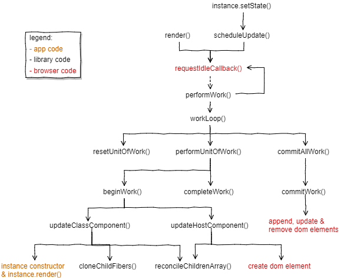

翻译自这里：https://engineering.hexacta.com/didact-fiber-incremental-reconciliation-b2fe028dcaec

React16已经发布了，其内部重写了很多代码，内部结构也发生了一些变化，有一些新的特性也随之推出。我们在之前系列里写的代码多多少少有些过时了。在这一节，我们将会根据React16的最新结构来重写大部分的代码，代码结构和变量命名我们也会尽量按照React16的来。对于我们暴露出来的API用不到的东西我们会一并跳过，这些公开API包括：

* `Didact.createElement`
* `Didact.render()`（用来DOM渲染）
* `Didact.Component`(带有`setState()`，但没有`context`及其他生命周期方法)

如果你想直接看代码及运行效果，可以看[这里](https://codepen.io/pomber/pen/veVOdd)，或者访问[代码库](https://github.com/pomber/didact)。


好了，先来解释下以前的代码为什么需要重写。

#### Why Fiber

> 我们不会解释的很详细，如果你想具体了解，可以看一下这个[list](https://github.com/koba04/react-fiber-resources)

当浏览器的主线程一直被某一任务占用时，其他任务就无法去执行，直到占用主线程的任务完成，其他任务才有可能被执行。

我做了一个[demo](https://pomber.github.io/incremental-rendering-demo/react-sync.html)来展示上面提到的问题。为了保持星球的持续转动，主线程至少每隔16ms就需要空闲出来以渲染页面。假如主线程一直被其他任务占用，比如占用了200ms，你就会发现动画有一些丢帧（通俗的说就是卡顿），在主线程被占用时星球会停着不动。

那么是什么一直占用着主线程，使得主线程无法去执行渲染任务以至于页面有卡顿呢？

还记得我们写的[一致性校验的代码](https://engineering.hexacta.com/didact-instances-reconciliation-and-virtual-dom-9316d650f1d0)么？一旦开始一致性校验，过程就不会停止。此时，如果其他任务需要执行，那么只有排队等待。而且，因为一致性校验是一个递归的规程，所以很难暂停。接下来我们将会使用一种新的数据结构来重写一致性校验的代码，并用循环来代替递归。

#### Scheduling micro-tasks

我们需要把__任务__分割成更细小的__任务片__，以单位任务片的方式来执行这些任务，在执行的间隙，主线程可以去执行有更高优先级的其他任务，结束之后再回来继续执行剩余的任务片。

我们将定义一个`requestIdleCallback()`方法来完成上述功能。这个方法会维护一个回调，这个回调是下次浏览器空闲时需要去执行的任务。在执行这个回调时还会传入一个`deadline`参数，用来描述当前有多少时间可以用来执行这个任务。

```javascript
const ENOUGH_TIME = 1; // 毫秒

let workQueue = [];
let nextUnitOfWork = null;

function schedule(task){
    workQueue.push(task);
    requestIdleCallback(performWork);
}

function performWork(deadline){
    if(!nextUnitOfWork){
       nextUnitOfWork = workQueue.shift();
    }
    
    while(nextUnitOfWork && deadline.timeRemaining() > ENOUGH_TIME ){
        nextUnitOfWork = performUnitOfWork(nextUnitOfWork);
    }
    
    if(nextUnitOfWork || workQueue.length > 0){
        requestIdleCallback(performWork);
    }
}
```

真正执行任务的是`performUnitOfWork`这个方法，我们的一致性校验算法也需要写到这个方法里面。这个方法会执行任务片并返回下次需要执行的任务片。

我们使用fiber来跟踪任务片的执行。

####The fiber data structure

每个组件（__注意，这里的组件不仅是用户定义的组件，也代表浏览器原生的HTML标签__）我们都会为其创建一个fiber。`nextUnitOfWork`指向的是下一次我们要运行的fiber。`performUnitOfWork`会执行当前的fiber并在执行结束后返回一个新的fiber。跟紧我，接下来我将详细解释一下。

先来看下fiber的结构：

```javascript
let fiber = {
    tag: HOST_COMPONENT,
   	type: 'div',
    parent: parentFiber,
    child: childFiber,
    sibling: null,
    alternate: currentFiber,
    stateNode: document.createElement('div'),
    props: {children: [], className: 'foo'},
    partialState: null,
    effectTag: PLACEMENT,
   	effects: []
}
```

看起来只是一个很普通的JS对象。

`parent`，`child`以及`sibling`将被用来构建一颗描述组件的fiber树。`stateNode`指向一个DOM元素或者是用户定义的组件的实例。


上面的图片展示了我们需要支持的三种类型的组件：

* `b`，`p`及`i`这一类的fiber我们称为__host components__，用`tag:HOST_COMPONENT`来表示。这一类fiber的`type`属性值为一个字符串（即对应的html元素标签名）。`props`则放置着对应元素的属性和事件。
* `Foo`对应的fiber我们称为__class components__，对应的`tag`标签值为`CLASS_COMPONENT`。这一类fiber的`type`属性值为指向用户定义的组件类的引用。
* `div`对应的fiber我们称为__host root__。host root和host component都含有一个DOM元素作为`stateNode`的属性值，但host root作为fiber树的根，将会受到一些特别的对待。我们使用`tag:HOST_ROOT`来区分host root。注意到，此类fiber的`stateNode`对应的DOM节点将会被传入到`Didact.render()`中。

另一个比较重要的属性是`alternate`。__大多数情况下我们代码中存在两棵fiber树：一颗对应着已经渲染到页面的DOM，我们称之为current tree或者old tree；另一颗为我们更新（调用`setState()`或者`Didact.render()`）过程中构建的树，我们称之为work-in-progress tree。__（这两棵树的节点都是一个个fiber）

work-in-progress tree不会和old tree共享fiber。一旦work-in-progress tree构建结束，对应的DOM都被渲染完毕，work-in-progress tree就会变成old tree。

`alternate`用来连接work-in-progress tree上的fiber对应的old tree上的fiber。一个work-in-progress tree上的fiber与它的`alternate`指向的old tree上的fiber拥有相同的`tag`，`type`和`stateNode`。当我们在渲染一个新的结构时，对应的fiber不会含有`alternate`属性。

接下来是`effects`数组和`effectTag`。当work-in-progress tree上的某一个fiber需要对DOM做一些变更时，我们会给这个fiber设置`effecttTag`属性，取值有三种：`PLACEMENT`，`UPDATE`，或者`DELETION`。为了更方便的实施DOM的变更，我们将当前fiber下含有`effectTag`属性的子fiber都保存在当前fiber的`effects`数组中。

上面说了比较多的概念，一时理解有些困难，如果跟不上也不要担心，下面我们在实际代码中来了解一下fiber。

####Didact call hierarchy

我们通过流程图来感知一下代码的调用层次：



我们会从`render()`或者`setState()`开始，到`commitAllWork()`结束。

#### Old code

在开始重写之前先来回顾下以前写的代码。

在[Element creation and JSX](https://engineering.hexacta.com/didact-element-creation-and-jsx-d05171c55c56)中我们编写了[`crerateElement()`](https://gist.github.com/pomber/2bf987785b1dea8c48baff04e453b07f)方法用来转译JSX。这个方法不需要改动，元素的结构也没有发生变化。如果你不知道我们所说的元素，`type`，`props`和`children`是什么，那么你需要回顾一下之前的内容。

在[Instances, reconciliation and virtual DOM](https://engineering.hexacta.com/didact-instances-reconciliation-and-virtual-dom-9316d650f1d0)这一节我们写了`updateDomProperties()`方法用来更新DOM节点的属性。我们还写了`createDomElement()`方法用来创建DOM节点。这两个方法你都可以在[dom-utils.js](https://gist.github.com/pomber/c63bd22dbfa6c4af86ba2cae0a863064)中看到。

在[Components and state](https://engineering.hexacta.com/didact-components-and-state-53ab4c900e37)这一节我们编写了`Component`基础类。这个类需要一些改动。`setState()`方法中需要去调用`scheduleUpdate()`方法。此外还要创建一个`createInstance`方法来代替之前的`createPublicInstance()`方法，`createInstance`创建的实例保存了自身对应的fiber的引用。

```javascript
class Component{
    constructor(props){
        this.props = props || {};
        this.state = this.state || {};
    }
    
    setState(partialState){
        scheduleUpdate(this, partialState);
    }
}

function createInstance(fiber){
    const instance = new fiber.type(fiber.props);
    instance.__fiber = fiber;
    return instance;
}
```

我们就从上面这段代码开始，重写剩下的功能。


除了`Component`类和`createElement()`方法外，我们还有两个暴露出来的方法：`render()`和`setState()`，并且我们知道我们将在`setState()`中调用`scheduleUpdate()`。

`render()`方法和`scheduleUpdate()`方法有些类似，它们都会接收一个更新（__本文提到的更新既包括页面的初次渲染，也包括字面意义上的更新__）任务，然后放到队列中。

```javascript
// fiber分类标签
const HOST_COMPONENT = 'host';
const CLASS_COMPONENT = 'class';
const HOST_ROOT = 'root';

// 全局变量
const updateQueue = [];
let nextUnitOfWork = null;
let pendingCommit = null;

function render(elements, containerDom){
    updateQueue.push({
        from: HOST_ROOT,
        dom: containerDom,
        newProps: {children: elements}
    });
    requestIdleCallback(performWork);
}

function scheduleUpdate(instance, partialState){
    updateQueue.push({
        from: CLASS_COMPONENT,
        instance: instance,
        partialState: partialState
    });
    requestIdleCallback(performWork); // 延迟调用performWork
}
```

`updateQueue`数组用来盛装要实施的更新，每次调用`render()`或者`scheduleUpdate()`方法都会往`updateQueue`中增加一个更新操作。每个更新操作携带的信息都不相同，我们将会在接下来的`resetNextUnitOfWork()`方法中看到如何去实施这些更新。

在把更新放到队列中之后，我们对`performWork()`做了一个延迟调用（意思是在浏览器空闲的时候调用，requestIdleCallback为浏览器提供的API）。


```javascript
const ENOUGH_TIME = 1;

function performWork(deadline){
    workLoop(deadline);
    if(nextUnitOfWork || updateQueue.length > ){
        requestIdleCallback(performWork);
    }
}

function workLoop(deadline){
    if(!nextUnitOfWork){
        resetNextUnitOfWork(); // 产生第一个nextUnitOfWork
    }
    while(nextUnitOfWork && deadline.timeRemaining() > ENOUGH_TIME){
        nextUnitOfWork = performUnitOfWork(nextUnitOfWork);
    }
    if(pendingCommit){
        commitAllWork(pendingCommit);
    }
}
```

`requestIdleCallback()`方法会将一个deadline传入目标方法（就是`performWork()`）中，并执行这个方法。`performWork()`会将接收到的deadline再次传递给`workLoop()`方法，`workLoop()`执行结束后，`performWork()`中剩下的代码还会检查是否还有等待完成的任务，如果有，则会在浏览器空闲的时候再次调用自己。

`workLoop()`会监视着deadline参数，如果deadline太短，方法内部会自动停止循环，并保持nextUnitOfWork不做改变，下次会继续执行这个任务。

>  ENOUGH_TIME是一个代表1ms的常量，通过`deadline.timeRemaining()`与ENOUGH_TIME的比较来判断是否有足够的时间来执行当前这个任务。如果`performUnitOfWork()`所需要的时间超过ENOUGH_TIME，我们会适当增加deadline的值。deadline只是浏览器所建议的一个时间，所以增加几毫秒时没有什么问题的。
>
>  （We use `ENOUGH_TIME` (a 1ms constant, same as [React’s](https://github.com/facebook/react/blob/b52a5624e95f77166ffa520476d68231640692f9/packages/react-reconciler/src/ReactFiberScheduler.js#L154)) to check if `deadline.timeRemaining()` is enough to run another unit of work or not. If `performUnitOfWork()` takes more than that, we will overrun the deadline. The deadline is just a suggestion from the browser, so overrunning it for a few milliseconds is not that bad.----这一段说实话我不太明白什么意思）

`performUnitOfWork()`会为当前的更新操作构建一颗work-in-progress tree，并会比较出需要对DOM实施的变更。所有这些操作都是逐步进行的，每次只构建一个fiber节点。

当`performUnitOfWork()`结束了当前更新所需要做的任务之后，会返回`null`（这样循环就结束了）并将要实施的更新操作保存在`pendingCommit`变量中。最后，`commitAllWork()`会从`pendingCommit`中取出`effects`，并对对应的DOM实施变更操作。

注意到`commitAllWork()`是在循环外面调用的。`performUnitOfWork()`的任务完成后并没有对DOM进行变更（只是记录），所以它是可以分开执行的，而`commitAllWork()`是会对DOM进行改变的，所以为了保证代码和UI显示一致，需要一次性将`commitAllWork()`执行完毕。

说了这么多，我们依然不知道第一个`nextUnitOfWork`来自于哪里。


`resetUnitOfWork()`方法会接收一个更新操作并将其转化为`nextUnitOfWork`（其实就是根fiber）。

```javascript
function resetNextUnitOfWork(){
    const update = updateQueue.shift();
    if(!update){
        return;
    }
    // 将更新操作中携带的state复制给对应的fiber
    if(update.partialState){ // 通过setState()更新才会有partialState
        update.instance.__fiber.partialState = update.partialState;
    }
    
    const root = update.from == HOST_ROOT
    	? update.dom.__rootContainerFiber
    	: getRoot(update.instance.__fiber);
    
    // 注意看，这时候的fiber都是没有child属性的，返回的是根节点的fiber。
    // 就是old tree的根节点
   	// 每次更新肯定都是要重新构建fiber tree的，构建也是从根节点开始的，所以这地方返回的就是根节点
    nextUnitOfWork = {
        tag: HOST_ROOT,
        // 如果是render()引起的话，stateNode从update.dom取值，否则从root.stateNode取值
        stateNode: update.dom || root.stateNode,
        // props同理
        props: update.newProps || root.props;
        alternate: root
    };
}

function getRoot(fiber){
    let node = fiber;
    while(node.parent){
        node = node.parent;
    }
    return node;
}
```

首先，`resetNextUnitOfWork()`会从`updateQueue`头部取出一个更新操作，如果这个更新操作携带有`partialState`信息，那么将该信息复制到此次更新对应组件实例的fiber上，在稍后调用组件的`render()`方法时会用到这个`partialState`。

接下来是寻找old fiber tree的根节点。如果此次更新是整个应用第一次调用`render()`（第一次渲染）引起的，则不存在根fiber节点，所以`root = null`；如果此次更新是由非第一次调用`render()`方法引起的，我们则可以通过DOM节点的`__rootContainerFiber`属性找到根fiber节点；如果此次更新是由`setState()`引起的，则需要从当前fiber往上查找，直到找到没有`parent`属性那个fiber节点，即为根fiber节点。

找完根fiber节点后，我们给`nextUnitOfWork`赋值一个新的fiber。__这个fiber是一棵新work-in-progress tree的根fiber节点__（因为是本次渲染的第一个`nextUnitOfWork`，所以是根fiber节点）。

如果不存在old root（说明这是初次渲染），则`stateNode`就是传入`render()`方法的那个DOM节点，`props`是来自于此次渲染的`newProps`，`newProps`的`children`数组含有的其他元素也会被传入到`render()`方法中。`alternate`属性将会是`null`（因为是初次渲染，不存在old tree）。

如果存在old root（真正意义上的更新操作，增量渲染），则`stateNode`就是上一次渲染的根DOM节点，`props`同样会从`newProps`取值，如果`newProps`为`null`的话，则从old root上取值。`alternate`指向的就是old root。

现在已经有了work-in-progress tree个根fiber节点，接下来我们从这个根节点开始构建work-in-progress fiber tree。


```javascript
function performUnitOfWork(wipFiber){
    beginWork(wipFiber);
    if(wipFiber.child){
        return wipFiber.child;
    }
    
    // 如果没有子元素，则处理下effects然后去寻找兄弟元素
    let uow = wipFiber;
    while(uow){
        completeWork(uow); // 如果wipFiber没有子元素，或者当所有子节点都被处理完毕时会被调用
        if(uow.sibling){
            return uow.sibling； // 返回找到的兄弟元素，构建一个节点。
        }
        uow = uow.parent;
    }
}
```

`performUnitOfWork()`方法会贯穿于整棵fiber树的构建过程。

`beginWork()`用来为传入的fiber创建子fiber节点，然后将第一个子fiber节点返回作为下一个`nextUnitOfWork`参数。

如果当前已有fiber不存在子节点，则执行`completeWork()`方法，然后返回其兄弟节点作为下一个`nextUnitOfWork`参数。

如果当前fiber连兄弟节点也不存在，则向上查找，并逐层调用`completeWork`方法，直到找到并返回兄弟节点或者到达根节点。

fiber树的创建过程中，`performUnitOfWork()`会被调用多次。

我们会以深度优先的原则去创建一棵fiber树。从根节点开始，遍历每个节点的第一个子fiber节点（即child属性所指向的对象）。当到达某一个fiber节点时，我们会将该节点作为入参去调用`performUnitOfWork()`；如果某一fiber节点不含有子节点，则往右移动找寻兄弟节点，如果不存在兄弟节点则往上寻找祖先元素的兄弟节点，如此进行直到找到兄弟节点并将其带入到`performUnitOfWork()`中执行或者到达根节点。然后以当前节点为起点，继续按照深度优先的原则去遍历和创建fiber节点，整个过程会调用`performUnitOfWork()`多次，直到整棵树创建完毕。（可以在这里[fiber-debugger](https://fiber-debugger.surge.sh/)查看更生动的描述）


```javascript
function beginWork(wipFiber){
    if(wipFiber.tag == CLASS_COMPONENT){
        updateClassComponent(wipFiber)
    } else {
        updateHostComponent(wipFiber)
    }
}

function updateHostComponent(wipFiber){
    if(!wipFiber.stateNode){
        wipFiber.stateNode = createDomElement(wipFiber);
    }
    const newChildElements = wipFiber.props.children;
    reconcileChildrenArray(wipFiber, newChildElements);
}

function updateClassComponent(wipFiber){
    let instance = wipFiber.stateNode;
    if(instance == null){
        // 调用构造函数，创建实例
        instance = wipFiber.stateNode = createInstance(wipFiber)
    } else if(wipFiber.props == instance.props && !wipFiber.partialState){
        cloneChildFiber(wipFiber);
        return;
    }
    
    instance.props = wipFiber.props;
    instance.state = Object.assign({}, instance.state, wipFiber.partialState);
    wipFiber.partialState = null;
    
    const newChildElements = wipFiber.stateNode.render();
    reconcileChildrenArray(wipFiber, newChildElements);
}
```

`beginWork()`做了两件事：

* 如果传入的fiber没有`stateNode`节点的话为其创建一个。
* 获取组件的子元素，并将它们传入`reconcileChildrenArray()`中。

因为要考虑不同的组件类型，所以干脆就分成了两个方法来处理：`updateHostComponent()`和`updateClassComponent()`。

`updateHostComponent()`方法用来处理host components及root component两种类型组件。如果传入的fiber不含有`stateNode`，则方法会为其创建一个（只是创建一个节点且不含有子元素，更不会添加到页面上），然后方法会从fiber的`props`属性中取出`children`并传入`reconcileChildrenArray()`中去执行。

传入`updateClassComponent()`方法的fiber如果没有实例的话，则方法内部首先会通过调用组件的构造函数为其创建一个实例。创建出来的实例会被添加最新的 `props`和`state`属性，之后调用实例的`render()`方法来获取最新的子元素。如果传入进来的fiber有对应的实例，则说明不是一个新的节点。这时候如果fiber的props和实例的props相等，并且fiber上不带有`partialState`属性，则说明节点前后没有发生变化（相当于一个简易版的`shouldComponentUpdate()`），不需要重新渲染，直接克隆该节点到work-in-progress tree就可以了。

现在我们有了子元素`newChildElements`，可以继续向下构建work-in-progress fiber tree了。


`reconcileChildrenArray()`是一个比较核心的代码，fiber树的构建以及要对DOM实施的变化都会在这个方法里面完成。

```javascript
const PLACEMENT = 1;
const DELETION = 2;
const UPDATE = 3;

function arrify(val){
    return val == null ? null : Array.isArray(val) ? val : [val];
}

function reconcileChildArray(wipFiber, newChildElements){
    const elements = arrify(newChildElements);
    
    let index = 0;
    let oldFiber = wipFiber.alternate ? wipFiber.alternate.child : null;
    let newFiber = null;
    while(index < elements.length || oldFiber != null){
        const prevFiber = newFiber;
        const element = index < elements.length && elements[index];
        const sameType = oldFiber && element && element.type == oldFiber.type;
        
        if(sameType){ // 如果前后fiber类型一样，说明是一个更新操作
            newFiber = {
                type: oldFiber.type,
                tag: oldFiber.tag,
                stateNode: oldFiber.stateNode,
                props: element.props,
                parent: wipFiber,
                alternate: oldFiber,
                partialState: oldFiber.partialState,
                effectTag: UPDATE
            };
        }
        
        if(element && !sameType){
            newFiber = {
                type: element.type,
                tag: 
                	typeof element.type === 'string' ?HOST_COMPPONENT: CLASS_COMPONENT,
                props: element.props,
                parent: wipFiber,
                effectTag: PLACEMENT
            };
        }
        
        if(oldFiber && !sameType){
            oldFiber.effectTag = DELETION;
            wipFiber.effects = wipFiber.effects || [];
            wipFiber.effects.push(oldFiber); // 记录oldFiber的删除操作
        }
        
        if(oldFiber){
            oldFiber = oldFiber.sibling;
        }
        
        if(index == 0){
            wipFiber.child = newFiber; // fiber的child属性指向的是第一个子fiber
        } else if(prevFiber && element){
            prevFiber.sibling = newFiber; // 剩下的子fiber相互之间通过sibling属性关联
        }
        
        index++;
    }
}

```

一开始我们要确保传入的`newChildElements`是个数组。（这和我们之前写的一致性校验的算法有些不同，之前的`render()`方法返回的是一个对象，不支持数组，现在这个是子元素全部放在数组中，也就是说我们可以在组件的`render()`方法中直接返回一个数组了）。

接下来将`wipFiber.alernate`（即old fiber tree）的子节点与`wipFiber.props.children`对应的元素或者执行`wipFiber.stateNode.render()`后返回的元素进行比较。（fiber节点与元素进行比较，这地方的元素就是用对象表示的JSX）

在比较时，是`oldFiber`-`element`成对的比较。先是第一个fiber子节点（`oldFiber = wipFiber.alternate.child`）与第一个子元素（`elements[0]`）比较，比较结束后，`oldFiber`赋值为其自身的兄弟节点（`oldFiber = oldFiber.sibling`），然后继续与第二个子元素比较（`elements[1]`）。比较结束后再次执行`oldFiber = oldFiber.sibling`，然后再将`oldFiber`与`elements[2]`比较。以此方式比较下去：

* 如果`oldFiber`和对应的`element`有相同的`type`，则代表`oldFiber.stateNode`可以被重用，我们会基于`oldFiber`来创建一个新的fiber，并将新fiber的`effectTag`属性设置为`UPDATE`，然后将这个新的fiber添加到work-in-progress tree上。
* 如果`element`与对应的`oldFiber`的`type`属性值不一样，或者说当前的`element`没有对应的`oldFiber`（新增元素的情况），我们会根据`element`上含有的信息新建一个fiber。注意，这个新建的fiber没有`alternate`属性，也没有`stateNode`属性（`stateNode`属性会在`beginWork()`中被创建）。我们会将这个新建fiber的`effectTag`设置为`PLACEMENT`。
* 如果`element`与对应的`oldFiber`的`type`属性值不一样，或者`oldFiber`没有对应的`element`（说明有元素需要被删除），我们会将`oldFiber`的`effectTag`设置为`DELETION`。由于`oldFiber`并不是work-in-progress tree的一部，我们需要将其添加到`wipFiber.effects`列表中以防止丢失。

_我们并没有像React那样使用key属性来做一致性校验，如果子元素只是换了一个位置的话，我们的代码并不会做特殊处理。_


`updateClassComponent()`方法中考虑了一种特殊的情况，当某个节点不需要更新时，可以直接将对应old filber tree上的节点拷贝到work-in-progress tree上，省去了一致性校验的过程。

```javascript
function cloneChildFibers(parentFiber){
    const oldFiber = parentFiber.alternate; // 获取传入的fiber对应的oldFiber
    if(!oldFiber.child){
        return;
    }
    
    let oldChild = oldFiber.child;
    let prevChild = null;
    while(oldChild){ // 循环拷贝子元素
        const newChild = {
            type: oldChild.type,
            tag: oldChild.tag,
            stateNode: oldChild.stateNode,
            props: oldChild.props,
            partialState: oldChild.partialState,
            alternate: oldChild,
            parent: parentFiber
        };
        if(prevChild){
            prevChild.sibling = newChild;
        } else {
            parentFiber.child = newChild;
        }
        
        prevChild = newChild;
        oldChild = oldChild.sibling; //  通过sibling（兄弟）关系循环所有子元素
    }
}
```

`cloneChildFibers()`会克隆传入的`wipFiber.alternate`指向的fiber的所有子元素，并将它们添加到work-in-progress tree上。因为确定这些节点没有发生什么变化，所以并不需要添加`effectTag`属性。


在`performUnitOfWork()`中，当`wipFiber`没有子元素或者当所有子元素都被执行完毕后，我们就会调用`completeWork()`方法。

```javascript
function completeWork(fiber){
    if(fiber.tag == CLASS_COMPONENT){ // 如果是一个类组件
        fiber.stateNode.__fiber = fiber;
    }
    // 每次更新都要重新构建一整颗fiber树
    if(fiber.parent){
        const childEffects = fiber.effects || [];
        const thisEffect = fiber.effectTag != null ? [fiber] : [];
        const parentEffects = fiber.parent.effects || [];
        fiber.parent.effects = parentEffects.concat(childEffects, thisEffect);
    } else {
        pendingCommit = fiber;
    }
}
```

`completeWork()`首先更新传入的fiber对应实例类组件对象的fiber引用（可能不一定非要在这个地方，但代码里需要这么几行代码）。

接下来，方法内部会构建一个`effcts`列表，这个列表会将work-in-progres sub-tree上含有`effectTag`属性的fiber都包含在内（old sub-tree上含有`DELETION effectTag`的fiber也会被包含在这个effects列表中）。通过这样的`effects`列表，根fiber的`efffects`会包含所有带有`effectTag`的fiber。

最后，当fiber不含有`parent`属性时，说明我们已经到达了work-in-progress tree的根部，此时，我们已经完成了此次的更新操作所需要的工作，并收集了所有的effects。接下来，我们将根节点赋值给`pendingCommit`，然后`workLoop()`会去调用`commmitAllWork()`来完成更新。


接下来就剩一件事了，将更新实施到DOM上。

```javascript
function commitAllWork(fiber){
    fiber.effects.forEach(f => {
        commitWork(f);
    })
    // 根fiber节点对应的DOM节点有个__rootContainerFiber属性引用着根fiber
    fiber.stateNode.__rootContainerFiber = fiber;
    nextUnitOfWork = null;
    pendingCommit = null;
}

function commitWork(fiber){
    if(fiber.tag == HOST_ROOT){
        return;
    }
    
    let domParentFiber = fiber.parent;
    // 寻找一个dom类型的祖先fiber(stateNode属性对应为原生DOM)
    while(domParentFiber.tag == CLASS_COMPONENT){
        domParentFiber = domParentFiber.parent;
    }
    
    // 有了DOM才好去调用DOM的那些方法去操作DOM
    const domParent = domParentFiber.stateNode;
    
    if(fiber.effectTag == PLACEMENT && fiber.tag = HOST_COMPONENT){ // 添加一个DOM
        domParent.appendChild(fiber.stateNode);
    } else if(fiber.effectTag == UPDATE){ // 更新一个DOM
        updateDomProperties(fiber.stateNode, fiber.alternate.props, fiber.props);
    } else if(fiber.effectTag == DELETION){ // 删除
        commitDeletion(fiber, domParent);
    }
}

function commitDeletion(fiber, domParent){
    let node =fiber;
    while(true){
        if(node.tag == CLASS_COMPONENT){
            node = node.child;
            continue;
        }
        domParent.removeChild(node.stateNode);
        // 如果node不等于fiber，并且没有兄弟节点，说明已经删除完毕
        while(node != fiber && !node.sibling){
            node = node.parent; // 删除完毕后node重置为刚开始的值
        }
        if(node == fiber){
            return;
        }
        node = node.sibling;
    }

}
```

`commitAllWork()`会循环根fiber上的`effects`数组，针对每个元素都会去调用`commitWork()`方法。`commitWork`会检查每个fiber的`effectTag`属性：

* `effectTag:PLACEMENT`：先找到父DOM节点，然后直接将fiber的`stateNode`属性对应的DOM节点直接append到父DOM节点下。
* `effectTag:UPDATE`：将`stateNode`及其对应的新旧props传入`updateDomProperties`中，方法内部再去对节点进行更新。
* `effectTag:DELETION`：如果当前的fiber是一个host component（`stateNode`属性为一个原生DOM节点），这种时候直接通过其父节点调用`removeChild()`方法来删除该节点；如果当前的fiber是一个class component，在进行删除之前，需要找到组件对应的sub fiber-tree上所有的host component，然后再进行删除。

当前的effects都被实施后，需要重置`nextUnitOfWork`和`pendingCommit`，work-in-progress tree也变成了old tree，所以我们会将它的根节点设置到其对应DOM节点的`__rootContainerFiber`属性上。这些都做完后，当前的更新就都完成了，我们可以进行下一个了。

####Running Didact

把上面我们写的代码加入到Didact中，然后暴露公共API即可：

```javascript
function importDidact(){
    //...
    // All the code we wrote
    // ...
    
    return {
        createElement,
        render,
        Component
    };
}

/**@jsx Didact.createElement*/

class HelloMessage extends Didact.Component{
    render(){
        return <div>Hello {this.props.name}</div>;
    }
}

Didact.render(
	<HelloMessage name='John' >,
	document.getElementById('container')
)
```

####What's next?

React的很多特性Didact都没有，其中我比较感兴趣的就是根据优先级来调度更新：

```javascript
module.exports = {
    NoWork: 0,
    SynchronousPriority:  1, // For controlled text inputs.Synchronous side-effects.
    TaskPriority: 2,// Completes at the end of the current tick
    HighPriority: 3,//Interaction that needs to complete preety soon to feel responsive
    LowPriority: 4, //Data fetching, or result from updating stores
    OffscreenPriority: 5 //Won't be  visible but do the work in case it becomes visible
}
```

所以如果有下一节的话可能就会涉及到上面的内容。

以上就是全部内容了。如果你喜欢，别忘了点赞，或者[推特上关注我](https://twitter.com/pomber)。

记得留下你的评论。

感谢阅读，喜欢的记得点击star。